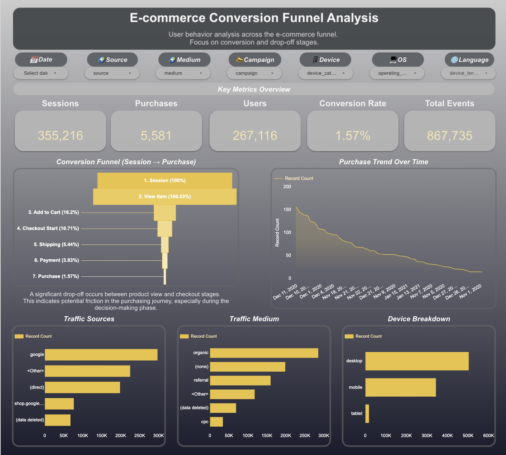

# 📊 GA4 E-commerce Funnel Analysis

This project analyzes user behavior across an e-commerce conversion funnel using GA4 BigQuery data.

The goal of the project is to identify drop-off points, analyze user behavior, and generate data-driven recommendations to improve conversion performance.

---

# 🎯 Project Objective

- Analyze the user journey from session to purchase
- Identify funnel drop-off points
- Compare traffic and device performance
- Build an interactive dashboard for business insights

---

# ⚙️ Tools & Technologies

- GA4 (Google Analytics 4)
- BigQuery SQL
- Looker Studio
- GitHub

---

# 🔍 Funnel Steps

- Session
- View Item
- Add to Cart
- Checkout
- Purchase

---

# 📊 Dashboard Preview

---

# 🔗 Interactive Dashboard

👉 https://datastudio.google.com/reporting/f375095a-1769-45e7-8ac9-ad84485c066d

---

# 🧾 SQL Query

👉 https://console.cloud.google.com/bigquery?sq=95931574254:8e6c745511774184875a8d759cd097e2

---

# 🎥 Project Walkthrough

A complete walkthrough of the project including:
- SQL data modeling
- Funnel analysis
- Dashboard insights
- Business recommendations

👉 https://www.loom.com/share/9d5c6ef3235d48c3bc81414a5672b5a1

---

# 📈 Key Metrics

- 355K Sessions
- 5.5K Purchases
- 1.57% Conversion Rate

---

# 💡 Key Insights

- Significant drop-off between View Item and Add to Cart
- Conversion rate is relatively low
- High traffic does not translate into high conversion
- Mobile users perform weaker than desktop users

---

# 🚀 Recommendations

- Improve product page experience
- Simplify checkout process
- Optimize mobile experience
- Run A/B tests
